Inspired by [Cafélog's post](https://cafelog.fr/one-album-for-every-year-of-my-life/), here's my list of favorite albums (one for every year since I was born, excluding the current year).

Good new music has a way of feeling like the best thing you've ever heard, until the novelty wears off. I don't want to be updating this list every time that happens, so I'll only revisit it once a year.

|Year|Cover Art|Album|
|-|-|-|
|1995|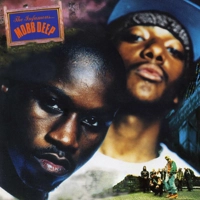|Mobb Deep – The Infamous|
|1996|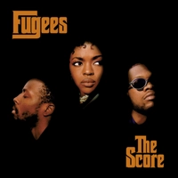|Fugees – The Score|
|1997|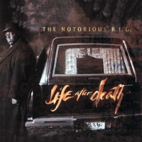|The Notorious B.I.G. – Life After Death|
|1998|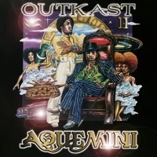|OutKast – Aquemini|
|1999||Mos Def – Black On Both Sides|
|2000||Common – Like Water For Chocolate|
|2001|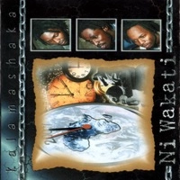|Kalamashaka – Ni Wakati|
|2002|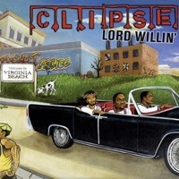|Clipse – Lord Willin'|
|2003|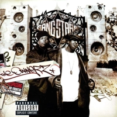|Gang Starr – The Ownerz|
|2004|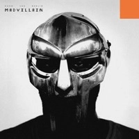|Madvillain (MF DOOM & Madlib) – Madvillainy|
|2005|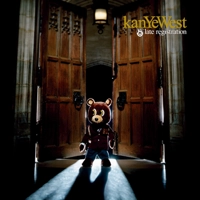|Kanye West – Late Registration|
|2006|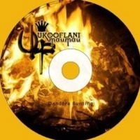|Ukoo Flani Mau Mau – Dandora Burning|
|2007|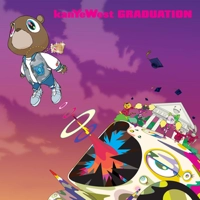|Kanye West – Graduation|
|2008|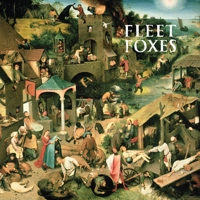|Fleet Foxes – Fleet Foxes|
|2009||Mos Def – The Ecstatic|
|2010|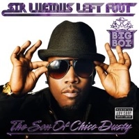|Big Boi – Sir Lucious Left Foot: The Son Of Chico Dusty|
|2011|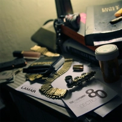|Kendrick Lamar – Section 80|
|2012||Kendrick Lamar – Good Kid, M.A.A.D City|
|2013||Intransit Riddim – Various Artists|
|2014|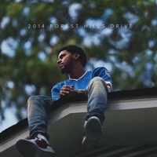|J. Cole – 2014 Forest Hills Drive|
|2015|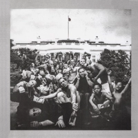|Kendrick Lamar – To Pimp A Butterfly|
|2016|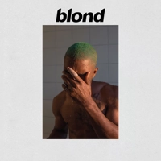|Frank Ocean – Blonde|
|2017||Kendrick Lamar – Damn|
|2018||Mac Miller – Swimming|
|2019||Common – Let Love|
|2020||Armand Hammer – Shrines|
|2021||Tyler, The Creator – Call Me If You Get Lost|
|2022||Billy Woods – Aethiopes|
|2023||Djungle & Kitu Sewer – Kaunenge|
|2024|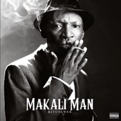|Kitu Sewer – Makali Man|
|2025||Clipse – Let God Sort Em Out|