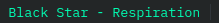
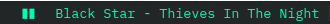
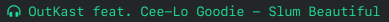

<style>
  img {width: 60%}
</style>

This was initially a post about adding what's playing on Spotify to [i3blocks](https://github.com/vivien/i3blocks). I had just started using i3blocks then and thought it was pretty cool how easy it was to do.
I've since discovered the possibilities are endless. You can add pretty much anything that outputs text to the statusbar.

Below are some examples of what's possible.

## Showing and controlling music

I like seeing what's playing without having to bring up the Spotify app every time. If I can also control playback without bring up the app, even better.

By default, i3 comes with [i3bar](https://i3wm.org/i3bar/). I'm sure I could achieve the same thing on i3bar [with enough time and effort](https://i3wm.org/docs/i3status.html#_external_scripts_programs_with_i3status), but its just much easier to do it with i3blocks.

Info on what's playing can be gotten using [playerctl](https://github.com/altdesktop/playerctl) or [spotify-cli-linux](https://github.com/pwittchen/spotify-cli-linux).

Then add the command to the i3blocks config:

```ini
[spotify]
command=spotifycli --status
color=#00FFB3
interval=2
```



I've opted to create a separate script file so I can handle mouse clicks.

```sh
#!/usr/bin/env bash

# i3blocks spotify script

spotifycli --status

case $BLOCK_BUTTON in
  1) spotifycli --prev ;;  # left click, previous
  2) spotifycli --playpause ;; # middle click, play/pause
  3) spotifycli --next ;; # right click, next
esac
```

```ini
; i3blocks config

[spotify-playback-status]
command=spotifycli --playbackstatus
color=#00FFB3
interval=2
separator=false

[spotify]
command=~/.config/i3blocks/scripts/spotify
color=#00FFB3
interval=2
```




I also tried this on Strawberry player using playerctl and it worked just as well.



## Showing [Wakatime](https://wakatime.com/) stats

Using [wakatime-cli](https://github.com/wakatime/wakatime-cli):

```ini
; i3blocks config

[wakatime]
label=
command=wakatime-cli --today
color=#3daee9
interval=300
```


