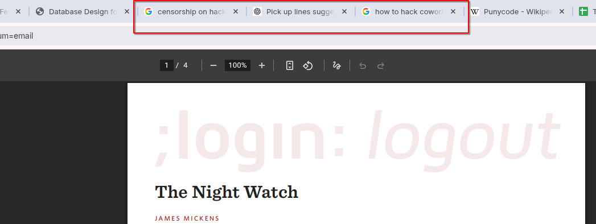
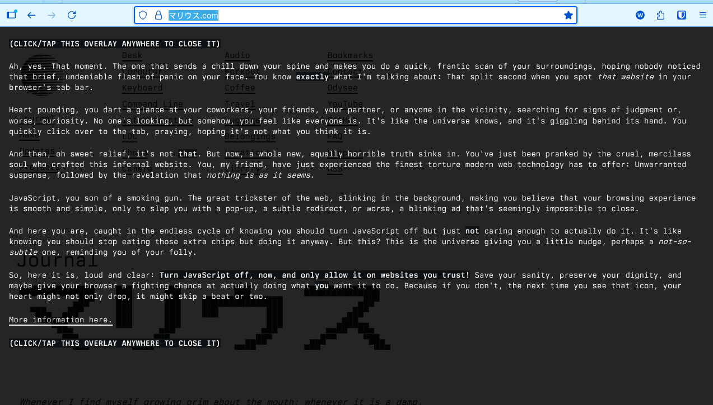
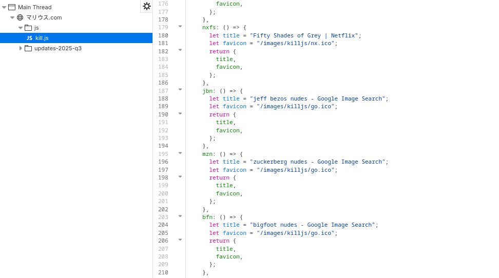

This is something I always knew you could do but never considered doing - until I came across [this site](https://マリウス.com/).
I was browsing some pages on that site, and had to leave to check something else on a different tab.
After a while, I noticed something weird with the tabs:

I'm pretty sure I didn't search for "censorship on hackernews", or "how to hack coworkers phone".
And I'm certainly not asking ChatGPT for Pick up lines suggestions 😂. What was going on?

Well, Javascript.

That message is shown when you go back to the tabs. Basically, the site uses Javascript to change the page title when the tab is not in focus.

This is not actually the first time I've seen this. The same thing happens on [sizeof.cat](https://sizeof.cat/),
but there it's done just for fun. That's why I never thought twice about it when I first saw it there.
The author of マリウス also [acknowledges](https://マリウス.com/updates-2025-q3/#site-updates) that he got the idea from the same source:
> I got the inspiration for this from this post by sizeof.cat, [...].

> While sizeof.cat uses this feature purely for the lulz, I believe it can serve as an effective way to encourage people to disable JavaScript in their browsers by default, and to be very selective about which websites they enable it for.

I think the fact that he decided to use this trick for this purpose is genius. Props to him. It's really effective.

Most of these titles are not too bad (though they would still raise eyebrows), but some would be quite embarrassing if seen in your tabs by others.

How do you explain to someone that the "jeff bezos nudes" tab they saw in the background wasn't actually a Google search for "jeff bezos nudes", 
but a joke from some blog on the internet?

I'm sure there are some security features on browsers to restrict the harm JS can do on your machine - but the fact that something like this can happen behind your back really makes you think.

Of course it's going to be a pain to turn off JS by default and manually enable it whenever I visit a site I need and find that it just won't work unless I have it enabled. But I'll try it out for a while and see how it goes.

Side note: I also learnt about [Punycode](https://en.wikipedia.org/wiki/Punycode) on that site, so - worth the visit.