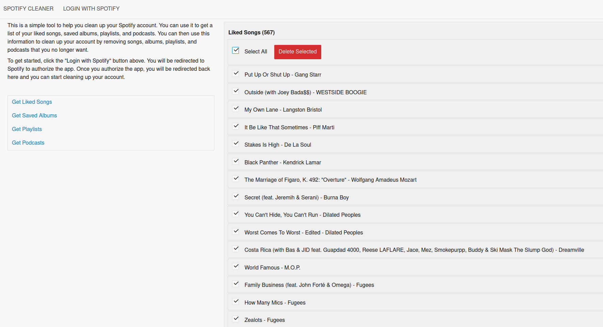

I've had my Spotify account for a long time, and over that time, my musical tastes have evolved.
As a consequence, there are a lot of liked songs, playlists, and podcasts I no longer listen to but have in my library.
There's nothing wrong with keeping them in the library—I don't have them downloaded, so they're not really taking up any space—but I don't like the clutter.

As far as I know, Spotify doesn't provide any way to batch delete things, so I created a [spotify-cleaner](https://github.com/wangonya/spotify-cleaner) for this.

I used it to delete everything (all liked songs, albums, podcasts, and playlists), but it can also delete just a few selected items.

If this is something you feel might also be useful to you, check the [repo](https://github.com/wangonya/spotify-cleaner) for instructions on how to use it.